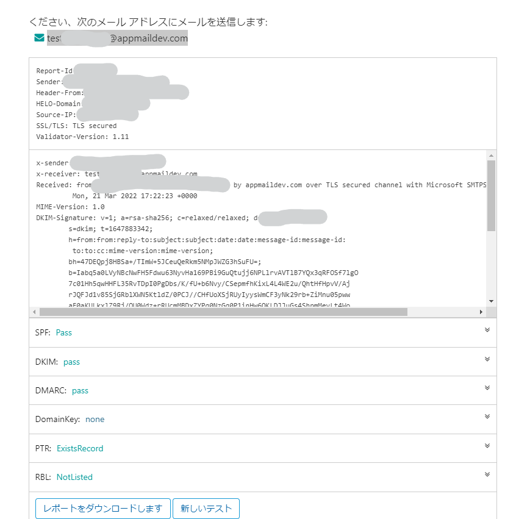

# Reasons for selection
## WebArena Indigo
In conclusion, **Overwhelming Const Performance**!

I originally planned to build a mail server on [Sakura VPS](https://vps.sakura.ad.jp/), but in order to run Mailu with antivirus software and other software
A minimum of 3 GB of memory was required.

At the time of writing (March 2022), the cheapest Ishikari region will cost **3,530 yen/month** if the memory is 3GB or more.

That's a bit expensive, isn't it? Then I remembered that one of my customers used to use [WebARENA Indigo](https://web.arena.ne.jp/indigo/price/) VPS, and I checked it out.
It's a pay-as-you-go system.

- 4GB memory
- SSD 80GB

and even if it is running all the time, the maximum cost is **1,272 yen/month**.

It is about 1/3 the price and has less SSD capacity, but considering that it is a mail server, this was a much better choice.

Translated with www.DeepL.com/Translator (free version)

## Mailu

In the words of the official website

> Mailu is a simple yet full-featured mail server as a set of Docker images. \
> It is free software (both as in free beer and as in free speech), open to suggestions and external contributions. \
> The project aims at providing people with an easily setup, easily maintained and full-featured mail server while not shipping proprietary software nor unrelated features often found in popular groupware.

So it looks very easy to use.

Specifically.

- Standard mail servers such as IMAP, IMAP+, SMTP
- Aliases, domain aliases, and custom routing
- Web-accessible administrator screen
- Auto-reply and auto-forward
- TLS, auto-signature with Let's Encrypt, DKIM, antivirus
- Anti-spam measures such as greylisting, DMARC, SPF

are supported.

Moreover, you can create a configuration file with GUI.
It's great!

<p style="opacity: 0.5">I was originally going to use <a href="https://github.com/docker-mailserver/docker-mailserver">Docker-Mailserver</a>, but I gave up because I couldn't get emails, even though I followed the instructions. </p>

## Cloudflare
This is what I used to build my original personal website (this site).

You can buy domains at wholesale prices, so I went to [Cloudflare Register](https://www.cloudflare.com/ja-jp/products/registrar/) to purchase a domain and set up DNS as well.

# Build a server
## setup environment
I selected Ubuntu 18.04 as the OS.

WebArena Indigo provides web access to the console. According to [here](https://web.arena.ne.jp/indigo/spec/login.html), the first time you boot

- Username: ubuntu
- Password: none (enter without typing anything)

However, it seems to fail in any way, so I decided to connect from my local terminal with ssh.


```shell
# install git, etc
sudo apt-get update
sudo apt-get install -y git vim curl wget unzip zip gnupg lsb-release ca-certificates

# install docker
curl -fsSL https://download.docker.com/linux/ubuntu/gpg | sudo gpg --dearmor -o /usr/share/keyrings/docker-archive-keyring.gpg
echo \
  "deb [arch=$(dpkg --print-architecture) signed-by=/usr/share/keyrings/docker-archive-keyring.gpg] https://download.docker.com/linux/ubuntu \
  $(lsb_release -cs) stable" | sudo tee /etc/apt/sources.list.d/docker.list > /dev/null

sudo apt-get update
sudo apt-get install docker-ce docker-ce-cli containerd.io

# install docker-compose
sudo curl -L "https://github.com/docker/compose/releases/download/1.26.0/docker-compose-$(uname -s)-$(uname -m)" -o /usr/local/bin/docker-compose
sudo chmod +x /usr/local/bin/docker-compose
```

Finish the installation of [docker-compose](https://docs.docker.jp/compose/overview.html) as follows.

## Mailu setup
You can use [Mailu configuration](https://setup.mailu.io/1.9/) to configure the settings from the GUI.


When you have finished entering all the information, enter **Setup Mailu** and follow the steps displayed to publish.

When you are done setting up, type

```shell
# start up the server first
$ sudo docker-compose -p mailu up -d

# You must first create one user to connect to the server.
# You can create an account called admin1@test.com with a password of PassWord with the following command
$ sudo docker-compose -p mailu exec admin flask mailu admin admin admin1 test.com PassWord

# The following command will also create an account named nagata@test.com with no administrative privileges
$ sudo docker-compose exec admin flask mailu user nagata test.com PassWord2
````


# Configure DNS
Once the server is created, we move on to DNS configuration.

## Minimum routing, etc.

### A Record
Use the A record to direct the part of the email address after the @ to the server you created above.

```text
mail.test.com.	1	IN	A	144.144.144.144
```

If you are using Cloudflare, you can use

| Type | Name | Content         | Proxy Status          | TTL  |
|------|------|-----------------|-----------------------|------|
| A    | mail | 144.144.144.144 | DNS only (gray cloud) | Auto |


You can make it **test.com** instead of **mail.test.com**, but I feel it is better to make it **mail.**. 

### MX Record
Configure name resolution with email.

```text
mail.test.com.	1	IN	MX	0 mail.test.com.
```

If you are on Cloudflare

| Type | Name | Content       | Proxy Status | TTL  |
|------|------|---------------|--------------|------|
| MX   | mail | mail.test.com | DNS only     | Auto |

If you want to receive mail sent to **test.com** as well, use the

```text
mail.test.com.	1	IN	MX	10 mail.test.com.
```
or

| Type | Name | Content       | Proxy Status | TTL  |
|------|------|---------------|--------------|------|
| MX   | @    | mail.test.com | DNS only     | Auto |

And you can receive it by adding `test.com` to `Mail Domains > Alternatives (Manage tab)` from the Mailu admin screen.

## Certificate
With the above settings, DKIM and SPF are not configured.
This means that they may be sorted into spam or not be received (gmail did not receive them).

So set the information appropriately.

From the admin screen, go to `Mail Domains > Details (Actions tab)` and **Regenerate keys** to generate the appropriate entries.

You can set everything except the DKIM public key to DNS for proofing.

Cloudflare is a GUI entry, so it's hard to do, but you can add it all at once by copying it all into a txt file in notepad or something, then importing it from **Advanced**.

# Test
You can email to a Gmail account and make sure it is not being sorted into spam.

To learn more about it, I recommend the following site.

[https://www.appmaildev.com/en/dkim](https://www.appmaildev.com/en/dkim)

Email to the email address shown after pressing **Next Step**.



It will tell you if each test passed, and you can easily correct it if it's wrong.

# Conclusion

By following these steps, you can easily build a mail server.

I highly recommend this and encourage you to give it a try.